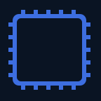

# Guide for built-in images

There are 64 official images from SmoredBoard built into the plugin, using variables
Here are the list of images with their variable name
You can use it by setting these variables in an image element expression field in the style tab of a button

## autoLoadButton

| Image                                                                                                                                     | Variable name                                                       |
| ----------------------------------------------------------------------------------------------------------------------------------------- | ------------------------------------------------------------------- |
| </img>           | `$(smoredboard:img_autoloadbutton_sd_auto_load_button_base64)`      |
| </img>               | `$(smoredboard:img_autoloadbutton_sd_auto_load_icon_base64)`        |
| </img> | `$(smoredboard:img_autoloadbutton_sd_auto_load_page_button_base64)` |
| </img>     | `$(smoredboard:img_autoloadbutton_sd_auto_load_page_icon_base64)`   |
| </img>         | `$(smoredboard:img_autoloadbutton_sd_button_background_base64)`     |

## censorButton

| Image                                                                                                               | Variable name                                            |
| ------------------------------------------------------------------------------------------------------------------- | -------------------------------------------------------- |
| </img>   | `$(smoredboard:img_censorbutton_sd_censor_icon_base64)`  |
| </img> | `$(smoredboard:img_censorbutton_sd_censor_image_base64)` |

## counter

| Image                                                                                     | Variable name                               |
| ----------------------------------------------------------------------------------------- | ------------------------------------------- |
| </img>       | `$(smoredboard:img_counter_icon_base64)`    |
| </img> | `$(smoredboard:img_counter_icon_2x_base64)` |
| </img>         | `$(smoredboard:img_counter_key_base64)`     |
| </img>   | `$(smoredboard:img_counter_key_2x_base64)`  |

## effectsButton

| Image                                                                                                                               | Variable name                                                    |
| ----------------------------------------------------------------------------------------------------------------------------------- | ---------------------------------------------------------------- |
| </img>                 | `$(smoredboard:img_effectsbutton_sd_effects_off_base64)`         |
| </img>                   | `$(smoredboard:img_effectsbutton_sd_effects_on_base64)`          |
| </img> | `$(smoredboard:img_effectsbutton_sd_effects_toggle_icon_base64)` |

## hearSelf

| Image                                                                                                         | Variable name                                         |
| ------------------------------------------------------------------------------------------------------------- | ----------------------------------------------------- |
| </img> | `$(smoredboard:img_hearself_sd_hear_self_off_base64)` |
| </img>   | `$(smoredboard:img_hearself_sd_hear_self_on_base64)`  |

## playingAnimation

| Image                                                                                                                                                   | Variable name                                                             |
| ------------------------------------------------------------------------------------------------------------------------------------------------------- | ------------------------------------------------------------------------- |
| </img> | `$(smoredboard:img_playinganimation_sd_sound_playing_animation_1_base64)` |
| </img> | `$(smoredboard:img_playinganimation_sd_sound_playing_animation_2_base64)` |
| </img> | `$(smoredboard:img_playinganimation_sd_sound_playing_animation_3_base64)` |
| </img> | `$(smoredboard:img_playinganimation_sd_sound_playing_animation_4_base64)` |
| </img> | `$(smoredboard:img_playinganimation_sd_sound_playing_animation_5_base64)` |

## playSound

| Image                                                                                                               | Variable name                                            |
| ------------------------------------------------------------------------------------------------------------------- | -------------------------------------------------------- |
| </img> | `$(smoredboard:img_playsound_sd_ad_sound_button_base64)` |
| </img>   | `$(smoredboard:img_playsound_sd_add_sound_icon_base64)`  |

## pushToTalk

| Image                                                                                                                       | Variable name                                                |
| --------------------------------------------------------------------------------------------------------------------------- | ------------------------------------------------------------ |
| </img> | `$(smoredboard:img_pushtotalk_mic_push_to_talk_icon_base64)` |
| </img>                   | `$(smoredboard:img_pushtotalk_sd_mic_muted_base64)`          |
| </img>                     | `$(smoredboard:img_pushtotalk_sd_mic_open_base64)`           |

## randomSoundButton

| Image                                                                                                                                                 | Variable name                                                             |
| ----------------------------------------------------------------------------------------------------------------------------------------------------- | ------------------------------------------------------------------------- |
| </img> | `$(smoredboard:img_randomsoundbutton_sd_random_sound_button_icon_base64)` |
| </img>           | `$(smoredboard:img_randomsoundbutton_sd_random_sound_button_base64)`      |
| </img>               | `$(smoredboard:img_randomsoundbutton_sd_random_sound_icon_base64)`        |
| </img>         | `$(smoredboard:img_randomsoundbutton_sd_random_sound_mode_on_base64)`     |
| </img>               | `$(smoredboard:img_randomsoundbutton_sd_random_sound_mode_base64)`        |

## Sfx Output

| Image                                                                                                                 | Variable name                                             |
| --------------------------------------------------------------------------------------------------------------------- | --------------------------------------------------------- |
| </img> | `$(smoredboard:img_sfx_output_sd_sfx_output_icon_base64)` |
| </img>   | `$(smoredboard:img_sfx_output_sd_sfx_output_off_base64)`  |
| </img>     | `$(smoredboard:img_sfx_output_sd_sfx_output_on_base64)`   |

## SoundSnap

| Image                                                                                                               | Variable name                                            |
| ------------------------------------------------------------------------------------------------------------------- | -------------------------------------------------------- |
| </img> | `$(smoredboard:img_soundsnap_sd_sound_snap_icon_base64)` |
| </img>       | `$(smoredboard:img_soundsnap_sd_soundsnap_on_base64)`    |
| </img>             | `$(smoredboard:img_soundsnap_sd_soundsnap_base64)`       |

## stop

| Image                                                                                                                           | Variable name                                                  |
| ------------------------------------------------------------------------------------------------------------------------------- | -------------------------------------------------------------- |
| </img> | `$(smoredboard:img_stop_stop_all_sounds_no_background_base64)` |
| </img>                             | `$(smoredboard:img_stop_stop_all_sounds_base64)`               |

## streamPauser

| Image                                                                                                                             | Variable name                                                   |
| --------------------------------------------------------------------------------------------------------------------------------- | --------------------------------------------------------------- |
| </img> | `$(smoredboard:img_streampauser_sd_stream_icon_squared_base64)` |
| </img>                 | `$(smoredboard:img_streampauser_sd_stream_icon_base64)`         |
| </img>             | `$(smoredboard:img_streampauser_sd_stream_paused_base64)`       |
| </img>             | `$(smoredboard:img_streampauser_sd_stream_played_base64)`       |

## toggleKeybinds

| Image                                                                                                                         | Variable name                                                 |
| ----------------------------------------------------------------------------------------------------------------------------- | ------------------------------------------------------------- |
| </img> | `$(smoredboard:img_togglekeybinds_sd_keybinds_icon_2_base64)` |
| </img>     | `$(smoredboard:img_togglekeybinds_sd_keybinds_icon_base64)`   |
| </img>       | `$(smoredboard:img_togglekeybinds_sd_keybinds_off_base64)`    |
| </img>         | `$(smoredboard:img_togglekeybinds_sd_keybinds_on_base64)`     |

## toggleMic

| Image                                                                                                     | Variable name                                       |
| --------------------------------------------------------------------------------------------------------- | --------------------------------------------------- |
| </img> | `$(smoredboard:img_togglemic_sd_mic_icon_2_base64)` |
| </img>     | `$(smoredboard:img_togglemic_sd_mic_icon_base64)`   |
| </img>       | `$(smoredboard:img_togglemic_sd_mic_off_base64)`    |
| </img>         | `$(smoredboard:img_togglemic_sd_mic_on_base64)`     |

## voiceChanger

| Image                                                                                                                               | Variable name                                                    |
| ----------------------------------------------------------------------------------------------------------------------------------- | ---------------------------------------------------------------- |
| </img> | `$(smoredboard:img_voicechanger_sd_voice_changer_button_base64)` |
| </img>     | `$(smoredboard:img_voicechanger_sd_voice_changer_icon_base64)`   |

## whiteIcons

| Image                                                                                                                                       | Variable name                                                        |
| ------------------------------------------------------------------------------------------------------------------------------------------- | -------------------------------------------------------------------- |
| </img>                     | `$(smoredboard:img_whiteicons_sd_add_sound_icon_w_base64)`           |
| </img>       | `$(smoredboard:img_whiteicons_sd_auto_load_button_icon_w_base64)`    |
| </img>           | `$(smoredboard:img_whiteicons_sd_auto_load_page_icon_w_base64)`      |
| </img>                     | `$(smoredboard:img_whiteicons_sd_hear_self_icon_w_base64)`           |
| </img>                       | `$(smoredboard:img_whiteicons_sd_keybinds_icon_w_base64)`            |
| </img>                                 | `$(smoredboard:img_whiteicons_sd_mic_icon_w_base64)`                 |
| </img> | `$(smoredboard:img_whiteicons_sd_random_sound_button_icon_w_base64)` |
| </img>     | `$(smoredboard:img_whiteicons_sd_random_sound_mode_icon_w_base64)`   |
| </img>           | `$(smoredboard:img_whiteicons_sd_stop_all_sound_icon_w_base64)`      |
| </img>       | `$(smoredboard:img_whiteicons_sd_toggle_hear_self_icon_w_base64)`    |
| </img>         | `$(smoredboard:img_whiteicons_sd_toggle_keybinds_icon_w_base64)`     |
